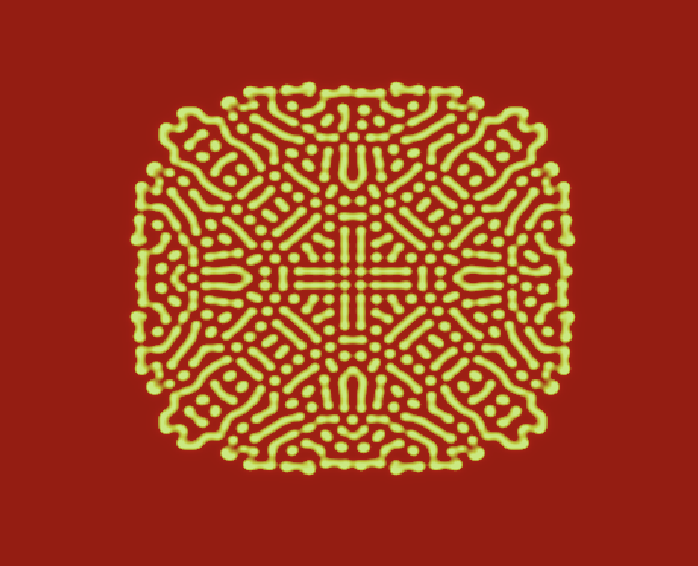
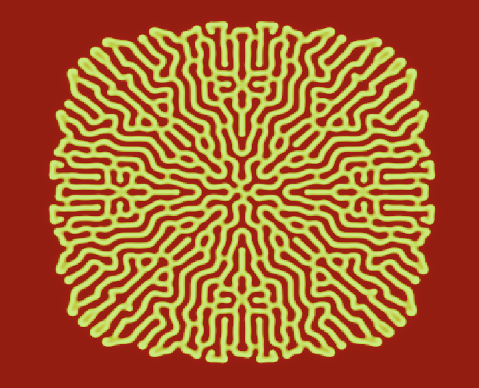

# Reaction Diffusion WGPU

A GPU-accelerated reaction-diffusion simulator written in Rust using `wgpu` and `wgsl`.

This project is part of an ongoing learning journey into compute shaders, real-time simulations, and graphics programming. The goal is to build a flexible simulation playground, explore visual patterns.

## Second Focus

After the fist focus is done, I want to focus on what i planned.

- [x] Hot reload
- [ ] Interactivity (Brush, Eraser, Pause, Play)
- [ ] UI to change color, parameters in real time

When these are done... I have to think about it

## First Focus

- [x] Minimal wgpu app with full-screen quad
- [x] GPU-based Gray-Scott compute shader
- [x] Ping-pong texture simulation
- [x] Real-time visualization via fragment shader

When these are done, the focus is going to be interactivity, hotreload and maybe UI.

## Requirements

- Rust
- A GPU that supports WebGPU (Vulkan, Metal, or DX12)

## Screenshots and Gifs

Right now the project can be cloned and started with reaction diffusion parameters that are hard coded and lead to the following pattern:

  

    
  

  

    
  

With parameters: DU = 0.19, DV = 0.08, FEED = 0.0345, KILL = 0.062

with a bit of change:

  

    
  

  

    
  

With parameters: DU = 0.16, DV = 0.08, FEED = 0.0645, KILL = 0.062

## Math

The math and everything I do will be explained in [here](docs).
