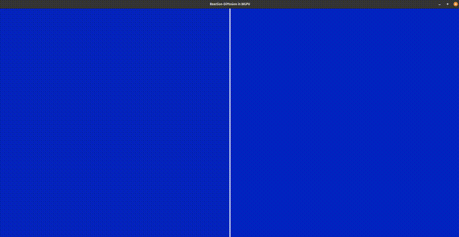
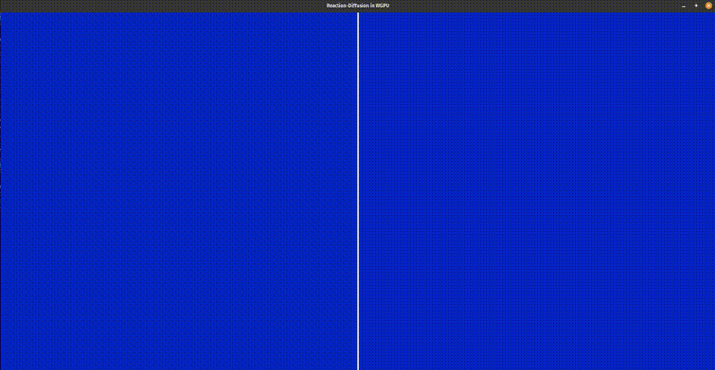

# Reaction Diffusion WGPU

A GPU-accelerated reaction-diffusion simulator written in Rust using `wgpu` and `wgsl`.

This project is part of an ongoing learning journey into compute shaders, real-time simulations, and graphics programming. The goal is to build a flexible simulation playground, explore visual patterns.

## Third Focus

I want to work more on the code base and make it reusable for my future works (hopefully life doesn't get in the way).

- [x] Render Graph
  - I am not going to make a full engine. I just want to try get to a point that I can reuse my mini-engine. In the future projects, I can expand it and change it.
- [x] More mathematical stability and accuracy
  - I have the idea of making split screen where the user can look at the evolution of two system at the same time and so having a more stable algorith where the user can change the speed of the evolution without really messing up the accuracy sound nice. Which is the last point of focus here in this list
- [x] the user can run multiple RD systems with different parameters at the same time as split screen
- [ ] post-processing phases and add different views and thems
- [ ] Add UI

There are many stuff I want to add to have a fully interactive reaction diffusion system that feels fun to use and watch as patterns evolve.

## Second Focus

After the fist focus is done, I want to focus on what i planned.

- [x] Hot reload (color map)
- [x] Interactivity (Brush, Eraser, Pause, Play)
- [x] Add different starting blob shapes / reset

## First Focus

- [x] Minimal wgpu app with full-screen quad
- [x] GPU-based Gray-Scott compute shader
- [x] Ping-pong texture simulation
- [x] Real-time visualization via fragment shader

When these are done, the focus is going to be interactivity, hotreload and maybe UI.

## Requirements

- Rust
- A GPU that supports WebGPU (Vulkan, Metal, or DX12)

## Screenshots and Gifs

Two reaction diffusion system with different parameters run at the same time. The user can interact using the mouse. The mouse works like a brush and can add elements and also erase.

  

    
  

In the split screen mode the user has control over sides independently. Using arrow keys, the user can restart and change the starting shape of the blob for each side.

  

    
  

## Interactivity

| Key         | What it does                              |
| ----------- | ----------------------------------------- |
| 1           | Add element V                             |
| 2           | Add element U                             |
| 0           | Erase                                     |
| p           | Pause/Play                                |
| r           | Reset the simulation                      |
| a           | Change the starting blob shape to Circle  |
| b           | Change the starting blob shape to Square  |
| c           | No starting blob                          |
| mouse wheel | Resize the brush                          |
| left arrow  | Select left side of split screen to edit  |
| right arrow | Select right side of split screen to edit |
| up arrow    | Select both side of split screen to edit  |

## Math and Design

The math and everything I do will be explained in [here](docs). There I will explain what the ping-pong buffer is that I used. When I make the render graph, I explain why I decided to go this way with the project.
