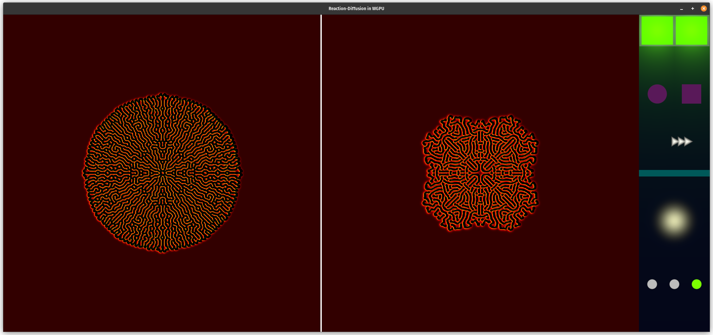
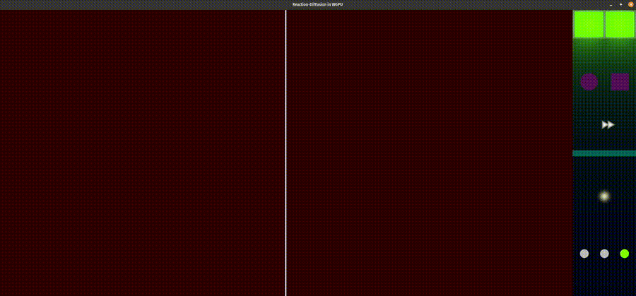
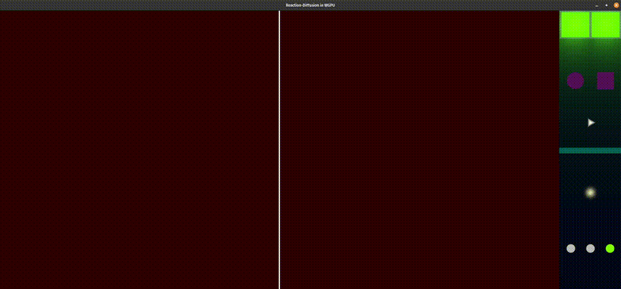

# Reaction Diffusion WGPU

> version 1.0

A GPU-accelerated reaction-diffusion simulator written in Rust using `wgpu` and `wgsl`.
This is my first somewhat large project that is meant to learn more about `wgpu`, `wgsl`, render graphs, memory management and interactivity. I have tried to explain the math and what I wanted to do and why I designed this program this way [here in docs](docs). This program by default solves two systems reaction diffusion systems in a split-screen mode with default parameters:

| Parameters       | Left Screen | Right Screen |
| ---------------- | ----------- | ------------ |
| U diffusion rate | 0.16        | 0.2          |
| V diffusion rate | 0.08        | 0.1          |
| Feed             | 0.04        | 0.037        |
| Kill             | 0.06        | 0.062        |

These parameters can of course be modified in [State](src/state.rs). As of `version 1.0` these parameters must be changed before running the simulation. I am planning to change it in the future updates but I also want to focus on new projects now that I have learned a lot and have more experience.

  

    
  

## Features

- GPU compute pass implementing Gray–Scott reaction–diffusion
- GPU compute pass implementing Lambert diffusion to make a fake 3D effect
- Split screen simulation for parameter comparison
- Real-time interactivity (brush, injection, erasing)
- Parameterized initial conditions (Circle/Square/None)
- Simple re-usable render graph pipeline with texture ping-pong
- Adjustable simulation speed

Fully implemented in Rust + WGPU + WGSL

## How to run?

You need to clone the project and use cargo to run it.

> git clone https://github.com/ArminGEtemad/reaction_diffusion_wgpu.git
>
> cd reaction_diffusion_wgpu
>
> cargo run --release

## Interactivity

While the simulations run, there are ways to interact with them.

| Key         | What it does                              |
| ----------- | ----------------------------------------- |
| 1           | Add element V (left click)                |
| 2           | Add element U (left click)                |
| 0           | Erase (left click)                        |
| p           | Pause/Play                                |
| space       | controlling simulation speed              |
| r           | Reset the simulation                      |
| a           | Change the starting blob shape to Circle  |
| b           | Change the starting blob shape to Square  |
| c           | No starting blob                          |
| mouse wheel | Resize the brush                          |
| left arrow  | Select left side of split screen to edit  |
| right arrow | Select right side of split screen to edit |
| up arrow    | Select both side of split screen to edit  |

### Brush

Via mouse the user can inject substance V and U or even erase. The size of the brush can be changed useing the mouse wheel. Then the keys `1`, `2` and `0` change the mode of the brush. There is a minimal preview on the right side of the screen that shows the size of the brush and the current brush mode.

  

    
  

### Split Screen

Choosing which side of the split screen should be restarted and change its initial blub can be done using the arrow keys. Initially there is no blob (clean sheet state). The blob preview is shown on the right side though and can be triggered by restarting the simulation. There are only two blobs right now "Circle" and "Square".

  

    
  

### Play/Pause

The simulation can be played and paused using `p` key and the speed of the simulation can be modified with `space` key. The preview can again be seen on the right side.

  

    
  

## Dependencies

- winit 0.30.12
- wgpu 25.0
- pollster 0.4.0
- bytemuck 1.24.0
- notify 8.2.0

## License

This project is under [MIT License](LICENSE).
