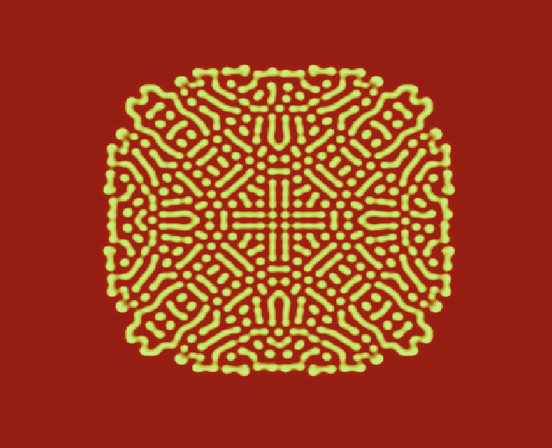
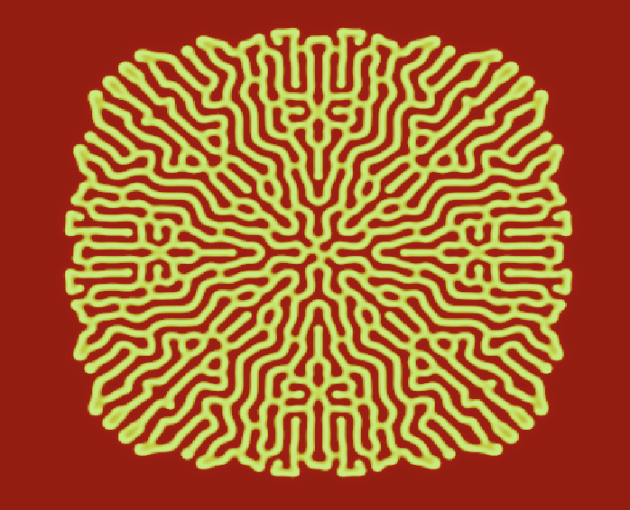

# Reaction Diffusion WGPU

A GPU-accelerated reaction-diffusion simulator written in Rust using `wgpu` and `wgsl`.

This project is part of an ongoing learning journey into compute shaders, real-time simulations, and graphics programming. The goal is to build a flexible simulation playground, explore visual patterns.

## Third Focus

I want to work more on the code base and make it reusable for my future works (hopefully life doesn't get in the way).

- [ ] Render Graph
- [ ] post-processing phases and add different views and thems
- [ ] maybe the user can run multiple RD systems with different parameters at the same time?

There are many stuff I want to add to have a fully interactive reaction diffusion system that fill fun to use and watch as patterns evolve.

## Second Focus

After the fist focus is done, I want to focus on what i planned.

- [x] Hot reload
- [x] Interactivity (Brush, Eraser, Pause, Play)
- [x] Add different starting blob shapes / reset

## First Focus

- [x] Minimal wgpu app with full-screen quad
- [x] GPU-based Gray-Scott compute shader
- [x] Ping-pong texture simulation
- [x] Real-time visualization via fragment shader

When these are done, the focus is going to be interactivity, hotreload and maybe UI.

## Requirements

- Rust
- A GPU that supports WebGPU (Vulkan, Metal, or DX12)

## Screenshots and Gifs

Right now the project can be cloned and started with reaction diffusion parameters that are hard coded and lead to the following pattern:

  

    
  

  

    
  

With parameters: DU = 0.19, DV = 0.08, FEED = 0.0345, KILL = 0.062

with a bit of change:

  

    
  

  

    
  

With parameters: DU = 0.16, DV = 0.08, FEED = 0.0645, KILL = 0.062

## Interactivity

There are three modes for the brush that the user can toggle in between using the keyboard keys `0`, `1` and `2`.
The size of the brush can be changed using the mouse wheel. The the key `p` can be used to pause and play the the simulation.

| Key         | What it does                             |
| ----------- | ---------------------------------------- |
| 1           | Add element V                            |
| 2           | Add element U                            |
| 0           | Erase                                    |
| p           | Pause/Play                               |
| r           | Reset the simulation                     |
| a           | Change the starting blob shape to Circle |
| b           | Change the starting blob shape to Square |
| c           | No starting blob                         |
| mouse wheel | Resize the brush                         |

## Math and Design

The math and everything I do will be explained in [here](docs). There I will explain what the ping-pong buffer is that I used. When I make the render graph, I explain why I decided to go this way with the project.
