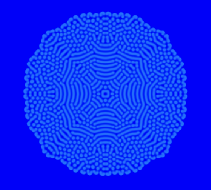
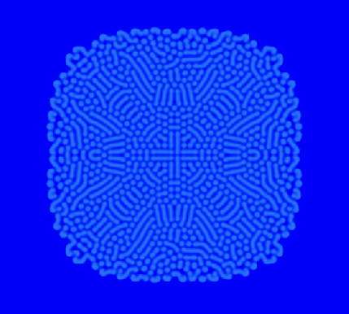

# Reaction Diffusion

My first idea for this project wasn't reaction diffusion in the beginning. I was more leaning towards N-Body problem or even fluid simulation. But because, my PhD project is just physics, I decided to get away from physics a bit but stay mathematical. Because I was interested in doing some `compute` pipelines in my project. So I decided to go with fractals. In the search for fractals that I could use for this project I saw some cool patterns which turned out to be a **Reaction Diffusion System**.

> a reaction diffusion refers to a mathematical model that describes how two or more chemicals react with each other and diffuse through a medium over time.

The raction diffusion can be mathematically described as:

```math
\frac{\partial u}{\partial t} = D_u \Delta u + f_u(u, v)\\

\frac{\partial v}{\partial t} = D_v \Delta v + f_v(u, v)\\
```

where $\Delta$ is the Laplacian and since we are in 2D:

```math
\Delta = \nabla^2 = \frac{\partial^2 }{\partial x^2} + \frac{\partial^2 }{\partial y^2}
```

## Laplace Operator

### 5 point stencil

When we want to calculate the Laplacian numerically, we can use finite elements. In two dimensions the Laplacian can be written as the following operator:

```math
L_{2D} = \begin{pmatrix}
0 & 1 & 0 \\
1 & -4 & 1 \\
0 & 1 & 0
\end{pmatrix}
```

which corresponds to

```math
\nabla^2 f(x, y) \approx f(x, y - 1) + f(x - 1, y) - 4 f(x, y) + f(x + 1, y) + f(x, y + 1)
```

In the numeric literature, we find the same equation but instead of $1$ we have an infinitesimal element of $h$. The whole RHS of the equation is also multiplide with $1/h^2$. Here we simply say $h = 1$ which is the grid spacing.

### 9 point stencil

The 5 point stencil actually is good enough for what I wanted to do. But I wanna get a smoother visuals. Going from 5 point stencil to 9 point does not make the simulation become more stable (I have to change my Euler method for that) but it makes the simulation more accurate and I hope to get less artifacts and nicer patterns.

The way to go is:

```math
L = (1 - \gamma) \begin{pmatrix}
0 & 1 & 0 \\
1 & -4 & 1 \\
0 & 1 & 0
\end{pmatrix}
+ \gamma \begin{pmatrix}
1/2 & 0 & 1/2 \\
0 & -2 & 0 \\
1/2 & 0 & 1/2
\end{pmatrix}
```

In this way, the Laplacian also takes the neighbors on the diagonal into account.

For Oono-Puri, $\gamma = 1/2$ and for Patra-Karttunen $\gamma = 1/3$.
For my first test I go with $\gamma=1/3$.

So the Kernel would become:

```math
L_{2D, 9 point} = \frac{1}{6} \begin{pmatrix}
1 & 4 & 1 \\
4 & -20 & 4 \\
1 & 4 & 1
\end{pmatrix}
```

The same system with a 9 point stencil looks like



While the identical system solved by 5 point stencil looks like 

TOTALLY DIFFERENT. I am not using the nine point because the patterns look cooler but because I get a more accurate result where the Laplacian does not ignore the diagonal neighbors and thus distorting the pattern. Of course, it make the GPU to read more texture but I think with modern GPUs it should be no problem.

## Numerics

### Theory

To calculate this differential equation I decided to go with Heun method (RK2) which is mostly just averaged over Euler forward and backward. But this tiny tweak makes the numerics more stable.
It goes as following:
For a differential equation with a known initial value $y(t = 0) = y_0$:

```math
\frac{dy}{dt} = f(y, t)
```

we have the predictor:

```math
y^*_{i+1} = y_i + h f(y_i, t_i)
```

and the corrector:

```math
y_{i+1} = y_i + \frac{h}{2} (f(y_i, t_i) + f(y^*_{i+1}, t_{i+1}))
```

### Implementation

For each I stage (predictor, corrector) make a separate compute pass and entry. However, I only need one bind group layout as following:

- 0 : uniform binding for `dt`
- 1 : sampled source `texture_2d<f32>`
- 2 : storage texture for the predictor and source texture for corrector, meaning that it has to be declared as `read_write` for `texture_storage_2d`.
- 3 : sotrage texture for corrector and ignored by predictor, meaning it is a `write` only `texture_storage_2d`.
