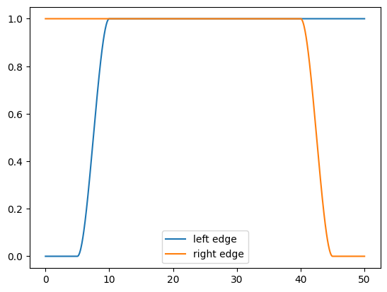
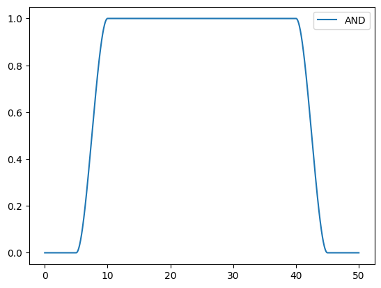
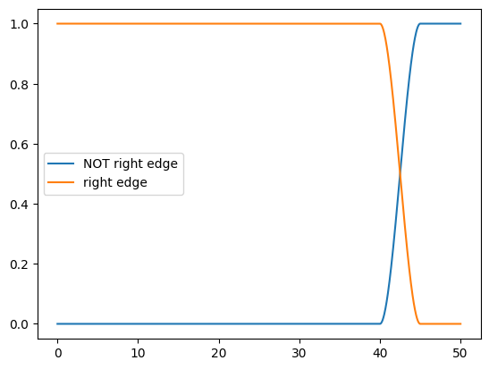
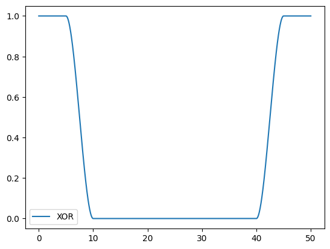

# UI

I decided to write my own very simple UI to learn more about the vertex and fragment shaders since until now my most work was focused on the compute shader. I decide to, at first, make a simple two panel rectangle that goes "on" depending on the side of the split screen chosen by the user.

## Anti-Aliasing (AA)

To smooth out the edges I wrote a simple AA for the rectangles instead of using sharp edges by using `if x > x_max then do this` which would result in sharp edges and we don't know if we really land on a exactly on a pixel or not. The smoothing is one pixel wide only using `fwidth()` function. This function gives us a resolution dependent smoothing width.

```math
fwidth(x) = |\partial_u x| + |\partial_v x|
```

Then for actual smoothing I use the `smoothstep()` which is

```math
f(\lambda) =
    \begin{cases}
    0, &\quad \lambda < 0 \\
    3 \lambda^2 - 2 \lambda^3, &\quad 0\leq\lambda\leq 1\\
    1, &\quad \lambda > 1
    \end{cases}
```

where $\lambda$ is a result from a `clamp()` function

```math
\lambda =
    \begin{cases}
    0, &\quad x < A \\
    (x-A)/(B-A), &\quad A\leq x \leq B\\
    1, &\quad x > B
    \end{cases}
```

We will get smoothings such as



To make a mask we look at these functions as something like a continuous booleans `A` and `B`. And we use the following gate for `AND = A * B`



Other cases

| Logical Operation | Formula (Arithmetic)            |
| ----------------- | ------------------------------- |
| NOT A             | $1.0 - A$                       |
| A AND B           | $A \times B$                    |
| A OR B            | $A + B - A \times B$            |
| A XOR B           | $A + B - 2.0 \times A \times B$ |
| A NAND B          | $1.0 - (A \times B)$            |
| A NOR B           | $(1.0 - A) \times (1.0 - B)$    |

as example the `NOT` would look like:



and `XOR` would be



Back to the mask we were making with the `AND`.

The mask is now 1D! In order to make it two dimensional, we multiply it with the exact same maske in y-axis `x-Axis AND y-axis`.

everything else in the shader was nothing new. I might explain them later though!
